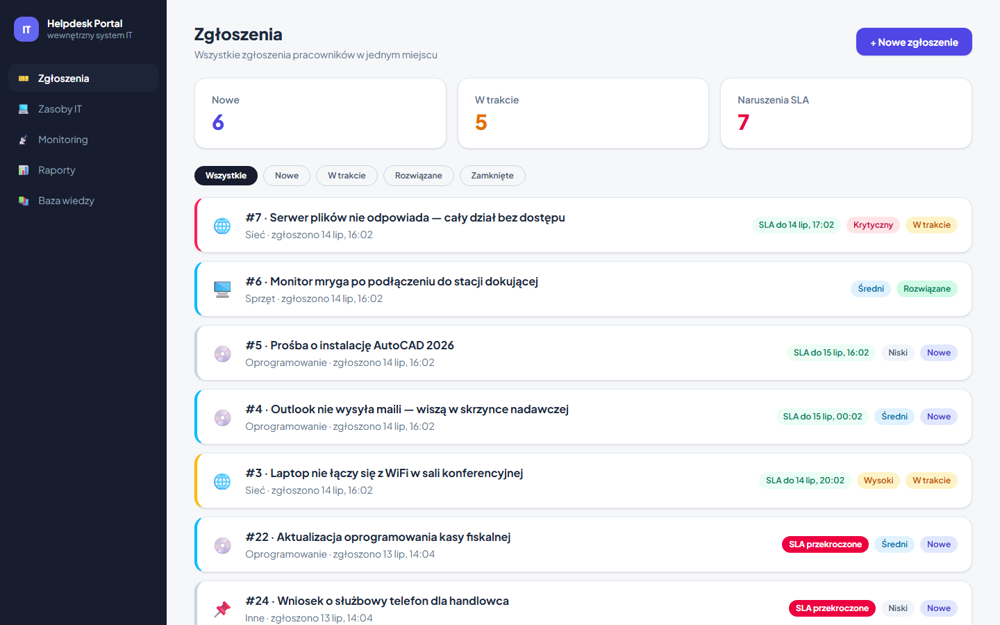
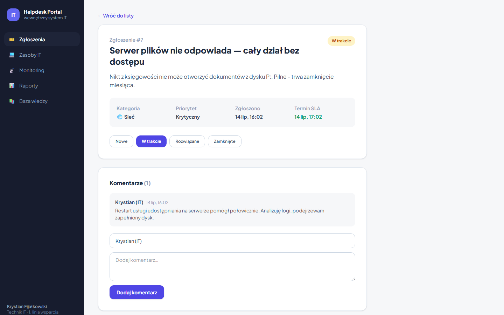
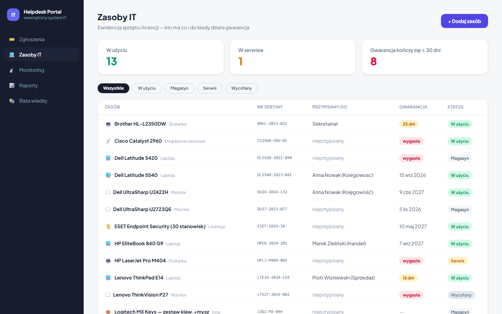
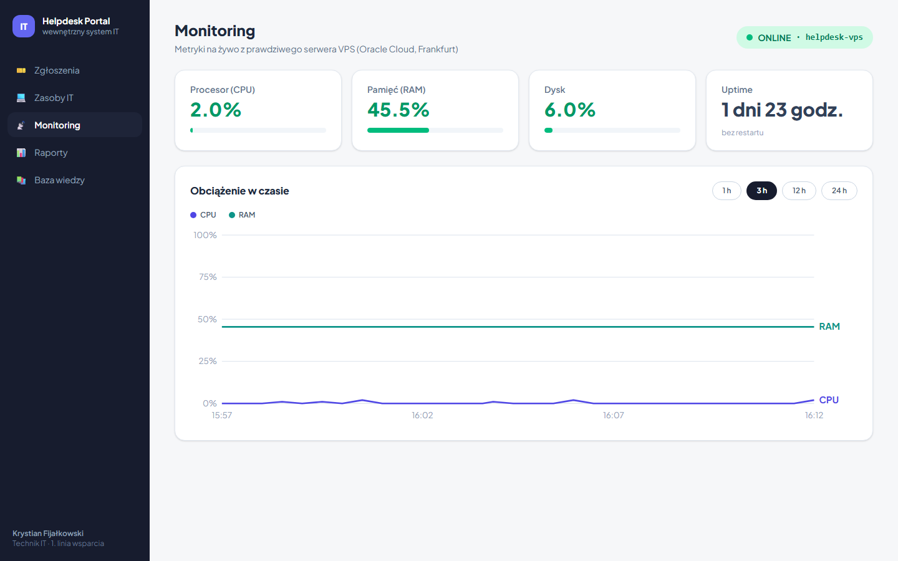
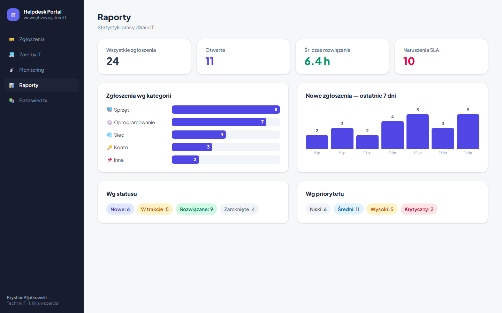
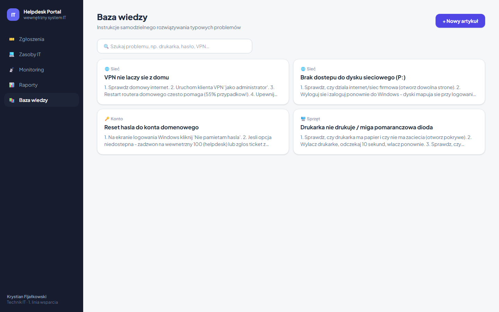

# IT Helpdesk Portal

Wewnętrzny portal działu IT — system obsługi zgłoszeń z licznikami SLA, ewidencja zasobów IT (CMDB), baza wiedzy, raporty oraz **monitoring prawdziwego serwera VPS w czasie rzeczywistym**.

> Projekt portfolio zbudowany od zera — od pierwszego commita po własny zabezpieczony serwer Linux w chmurze. Cały proces jest udokumentowany w [dzienniku prac](docs/dziennik.md).

## Funkcje

- 🎫 **System ticketów** — zgłoszenia pracowników z kategoriami i priorytetami, cykl życia (nowe → w trakcie → rozwiązane → zamknięte), komentarze, **terminy SLA liczone z priorytetu** i alerty ich naruszeń
- 💻 **Zasoby IT (CMDB)** — ewidencja sprzętu i licencji, przypisania do pracowników, **alerty wygasających gwarancji**
- 📡 **Monitoring na żywo** — agent na serwerze VPS (Oracle Cloud) wysyła metryki CPU/RAM/dysk/uptime; portal pokazuje status ONLINE/OFFLINE i wykresy historii
- 📊 **Raporty** — statystyki zgłoszeń, średni czas rozwiązania, naruszenia SLA, rozkłady wg kategorii/statusu/priorytetu
- 📚 **Baza wiedzy** — artykuły "jak samodzielnie rozwiązać typowe problemy" z wyszukiwarką

## Zrzuty ekranu

| | |
|---|---|
| **Zgłoszenia** — lista z badge'ami SLA  | **Szczegóły zgłoszenia** — komentarze i SLA  |
| **Zasoby IT** — ewidencja z gwarancjami  | **Monitoring** — żywe metryki z VPS  |
| **Raporty** — statystyki działu  | **Baza wiedzy** — instrukcje dla pracowników  |

## Architektura

```
                     Twój komputer                          Oracle Cloud (Frankfurt)
┌─────────────┐   proxy    ┌──────────────────┐  HTTPS/8000  ┌──────────────────────┐
│  React      │ ─────────► │  FastAPI backend │ ───────────► │  VPS Ubuntu 24.04    │
│  (Vite)     │   /api/*   │  + SQLite        │   X-API-Key  │  agent.py (systemd)  │
│  :5173      │            │  :8000           │              │  psutil → /metrics   │
└─────────────┘            └──────────────────┘              └──────────────────────┘
                            poller co 30 s                    firewall: 22, 8000
                            zapisuje historię                 fail2ban, tylko klucze SSH
```

| Warstwa | Technologia |
|---|---|
| Backend | Python 3, FastAPI, SQLAlchemy, Pydantic |
| Frontend | React (Vite), Tailwind CSS v4 |
| Baza danych | SQLite |
| Serwer | Ubuntu 24.04 na Oracle Cloud (Always Free), systemd, iptables, fail2ban |
| Agent monitoringu | FastAPI + psutil, autoryzacja kluczem API |

Konfiguracja serwera krok po kroku (SSH, firewall, hardening): [docs/vps-setup.md](docs/vps-setup.md)

## Jak uruchomić lokalnie

Wymagania: **Python 3.11+**, **Node.js 18+**, Git.

```bash
# 1. Pobierz projekt
git clone https://github.com/KrystianFijalkowski/helpdesk-portal.git
cd helpdesk-portal

# 2. Backend (terminal 1)
cd backend
python -m venv .venv
.venv\Scripts\activate          # Windows  (Linux/Mac: source .venv/bin/activate)
pip install -r requirements.txt
python seed_demo.py             # opcjonalnie: dane demonstracyjne
uvicorn main:app --reload       # API: http://localhost:8000 (dokumentacja: /docs)

# 3. Frontend (terminal 2)
cd frontend
npm install
npm run dev                     # aplikacja: adres wypisany przez Vite
```

**Monitoring (opcjonalnie):** moduł Monitoring wymaga własnego serwera z agentem.
Na serwerze zainstaluj agenta z folderu [agent/](agent/) jako usługę systemd
(wzór: `agent/helpdesk-agent.service`), a lokalnie skopiuj `backend/.env.example`
do `backend/.env` i uzupełnij adres serwera oraz klucz API. Bez tego portal
działa normalnie, a zakładka Monitoring pokaże status OFFLINE.

## Dokumentacja

- [Dziennik prac](docs/dziennik.md) — historia budowy projektu sesja po sesji, wraz z problemami i ich rozwiązaniami
- [Konfiguracja VPS](docs/vps-setup.md) — dokumentacja administracyjna serwera

## Autor

**Krystian Fijałkowski**
